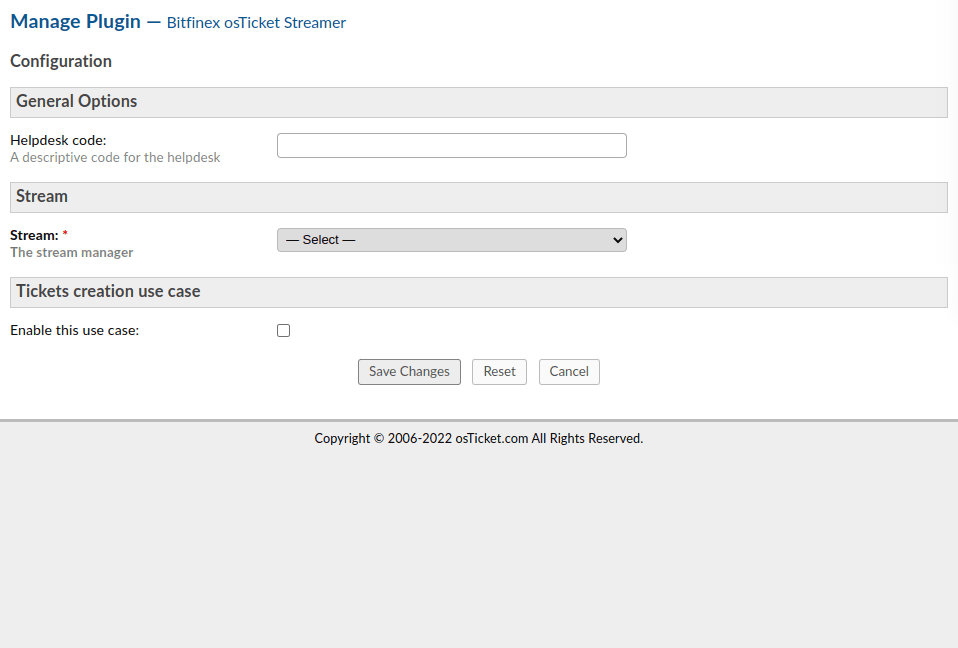
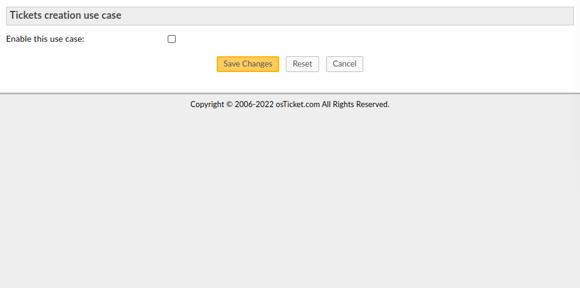
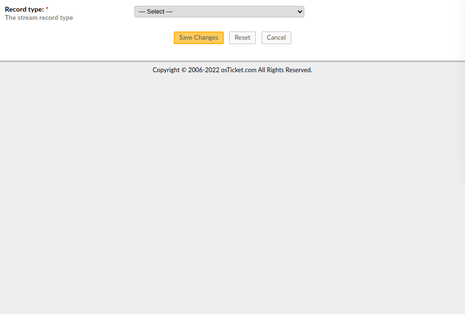

# Bitfinex osTicket Streamer

[](https://opensource.org/licenses/Apache-2.0)


[](https://github.com/osTicket/osTicket/tree/v1.10.7)
[](https://github.com/osTicket/osTicket/tree/v1.11)
[](https://github.com/osTicket/osTicket/tree/v1.12.6)
[](https://github.com/osTicket/osTicket/tree/v1.14.8)
[](https://github.com/osTicket/osTicket/tree/v1.15.8)
[](https://github.com/osTicket/osTicket/tree/v1.16.6)
[](https://github.com/osTicket/osTicket/tree/v1.17.3)


- [Introduction](#introduction)
- [Copying](#copying)
- [Prerequisites](#prerequisites)
- [Install](#install)
   - [Caveats](#caveats)
- [Options](#options)
   - [General Options](#general-options)
   - [Stream Options](#stream-options)
      - [Beanstalk Stream Options](#beanstalk-stream-options)
   - [Use Cases Options](#use-cases-options)
      - [Tickets Creation Use Cases Options](#tickets-creation-use-cases-options)
   - [Record Options](#record-options)
      - [Amazon Kinesis Record Options](#amazon-kinesis-record-options)
   - [Serializer Options](#serializer-options)
      - [CSV Serializer Options](#csv-serializer-options)
      - [JSON Serializer Options](#json-serializer-options)
      - [NDJSON Serializer Options](#ndjson-serializer-options)
   - [Encoder Options](#encoder-options)
      - [UTF-8 Encoder Options](#utf-8-encoder-options)
      - [Base16 Encoder Options](#base16-encoder-options)
      - [Base64 Encoder Options](#base64-encoder-options)
- [Signals](#signals)
   - [Format Signals](#format-signals)
   - [Option Signals](#option-signals)
   - [Use Case Signals](#use-case-signals)
- [Examples](#examples)
   - [Signal Examples](#signal-examples)
      - [Format Signal Examples](#format-signal-examples)
      - [Use Case Signal Examples](#use-case-signal-examples)
- [Maintainers](#maintainers)


## Introduction

The [*bfx-ost-streamer*](https://github.com/bitfinexcom/bfx-ost-streamer) is an [osTicket](https://osticket.com/) plugin that allows the creation of data streams to any third-party system.


## Copying

The [*bfx-ost-streamer*](https://github.com/bitfinexcom/bfx-ost-streamer) is free software. See the files whose names start with *LICENSE* (case-insensitive) for copying permission. The manuals, and some of the runtime libraries, are under different terms; see the individual source files for details.

Copyright years on [*bfx-ost-streamer*](https://github.com/bitfinexcom/bfx-ost-streamer) source files may be listed using range notation, e.g., 2017-2022, indicating that every year in the range, inclusive, is a copyrightable year that could otherwise be listed individually.


## Prerequisites

The [*bfx-ost-streamer*](https://github.com/bitfinexcom/bfx-ost-streamer) is a plugin for [osTicket](https://osticket.com/), it is therefore necessary to have it installed in order to use this plugin; here you can find the [system requirements](https://docs.osticket.com/en/latest/Getting%20Started/Installation.html#prerequisites). However, note that this plugin can also be used with previous versions of [osTicket](https://osticket.com/) (versions *greater than* or *equal to* *v1.10*), provided a [PHP](https://www.php.net/) version *greater than* or *equal to* *7.0* is used. In addition, the following [PHP](https://www.php.net/) extensions are also required:

- [Data Filtering](https://www.php.net/manual/en/book.filter.php)
- [Multibyte String](https://www.php.net/manual/en/book.mbstring.php)
- [JavaScript Object Notation](https://www.php.net/manual/en/book.json.php)

However, these extensions are default extensions of [PHP](https://www.php.net/) or requested by [osTicket](https://osticket.com/) itself so, most likely, none of these have to be installed.


## Install

The [*bfx-ost-streamer*](https://github.com/bitfinexcom/bfx-ost-streamer) is a standard [osTicket](https://osticket.com/) plugin, so it can be installed and configured following the standard procedure; see the [official osTicket guide](https://docs.osticket.com/en/latest/Admin/Manage/Plugins.html) to manage the plugins. Note that before activating the [*bfx-ost-streamer*](https://github.com/bitfinexcom/bfx-ost-streamer) plugin, it is required to run [composer](https://getcomposer.org/) within this plugin directory to install external libraries and verify that the environment meets all the requirements.

### Caveats

In order to be extensible by other plugins, [*bfx-ost-streamer*](https://github.com/bitfinexcom/bfx-ost-streamer) have to be loaded as late as possible, so that when its *bootstrap* method is executed, other plugins have already subscribed to the events of their interest. Unfortunately, [osTicket](https://osticket.com/) does not provide a proper dependency management and load sorting; however, starting with version **v1.15.2**, [osTicket](https://osticket.com/) loads plugins by name (alphabetically) instead of by installation ID. This plugin attempts to exploit this sorting by placing a double underline before its name (on the database only), to make sure it is loaded as last; this workaround has a negligible side effect that does not affect normal use.

If your version of [osTicket](https://osticket.com/) is lesser than **v1.15.2** and you are unwilling or unable to apply [this patch](https://github.com/osTicket/osTicket/pull/5744.diff), you are out of luck and have to play with the order of installation.


## Options

The intended audience of this section are end users, who will have to configure the [*bfx-ost-streamer*](https://github.com/bitfinexcom/bfx-ost-streamer) plugin via the [administration panel](https://docs.osticket.com/en/latest/Admin%20Panel.html).

The [*bfx-ost-streamer*](https://github.com/bitfinexcom/bfx-ost-streamer) requires several configurations in order to be run properly. There are various sections that have to be configured; below is a brief introduction to the main ones.

### General Options

In this section there are some general settings such as, for example, the *helpdesk code*. This is an optional configuration that can be used to identify a specific instance; this code must start with an alphabetic character followed by alphabetic characters, hyphens or underscores, for a maximum total length of *8* characters.

### Stream Options

In this section you can choose the stream type where to submit the [records](#record-options) and configure different general settings of it. Options that appear in this section, after the type of stream has been chosen, depend on the stream itself; see the following sections for more information. Basically, a stream represents the set of all the events of the same type that occurred over time.



Note that third-party plugins can add more streams to those provided by default, see the [Format Signals](#format-signals) section for more information.

#### Beanstalk Stream Options

[Beanstalk](https://beanstalkd.github.io/) is a simple, fast work queue. Its interface is generic, but was originally designed for reducing the latency of page views in high-volume web applications by running time-consuming tasks asynchronously. Although it is not really a stream according to the formal definition, it can improve the reliability of the system by switching from a "*fire and forget*" paradigm to an improved management of jobs with a strategy to retry in case of an error. See the [protocol specifications](https://raw.githubusercontent.com/beanstalkd/beanstalkd/master/doc/protocol.txt) for an overview and constraints on some options.

Note that when using the [Beanstalk](https://beanstalkd.github.io/) as a stream, [osTicket](https://osticket.com/) will act as a *producer*, therefore an external program that acts as a *consumer* is necessary in order to forward the records to the real stream.

### Use Cases Options

A use case represents a type of event that occurs on the [osTicket](https://osticket.com/) instance; here follows a list of use cases supported by the [*bfx-ost-streamer*](https://github.com/bitfinexcom/bfx-ost-streamer) plugin, one for each event, which can be configured independently. Note that third-party plugins can add more use cases to those provided by default, see the [Use Case Signals](#use-case-signals) section for more information.

Basically, for each use case, the following main options should be configured:

- whether to enable the streaming of this use case
- how data should be serialized; this determines the type of [stream](#stream-options) that will be created. See the [Serializer Options](#serializer-options) section for a list of all available serializer types
- record type; this is normally bound to the [stream](#stream-options) type but, in the case of an agnostic stream (eg [Beanstalk](#beanstalk-options)), it may also not be. See the [Record Options](#record-options) section for a list of all available record types



Other settings may be available, depending on the various selected options; for example, if the [stream](#stream-options) supports several queues, this can be chosen in this section so that each use case can be sent to its own queue.

#### Tickets Creation Use Cases Options

The ticket creation use case describes the event that occurs whenever a new ticket is created; by default only a few information is sent to the [stream](#stream-options), here's the list:

- `helpdesk_code` as explained in the [General Options](#general-options) section
- `datetime_complete` is the date and time of the instant in which the new ticket has been created
- `department_id` is the identifier of the department under which the ticket has been created
- `department_name` is the name of the department under which the ticket has been created
- `helptopic_id` is the identifier of the help topic that has been assigned to the newly created ticket
- `helptopic_label` is the name of the help topic that has been assigned to the newly created ticket

However, third-party plugins can add more information to those streamed by default, see the [Use Case Signals](#use-case-signals) section for more information.

### Record Options

In this section the record type that will be sent to the [stream](#stream-options) can be chosen and several settings can be configured. Options that appear in this section, after the type of record has been chosen, depend on the record itself; see the following sections for more information. Basically, a record represents a single event in the [Stream](#stream-options).



Note that third-party plugins can add more records to those provided by default, see the [Format Signals](#format-signals) section for more information.

#### Amazon Kinesis Record Options

This type of record is suitable for use with [Amazon Kinesis Data Firehose](https://docs.aws.amazon.com/firehose/latest/dev/what-is-this-service.html), a fully managed service for delivering real-time [streaming data](http://aws.amazon.com/streaming-data/) to destinations such as Amazon Simple Storage Service (Amazon S3), Amazon Redshift, Amazon OpenSearch Service, Splunk, and any custom HTTP endpoint or HTTP endpoints owned by supported third-party service providers, including Datadog, Dynatrace, LogicMonitor, MongoDB, New Relic, and Sumo Logic. [Kinesis Data Firehose](https://docs.aws.amazon.com/firehose/latest/dev/what-is-this-service.html) is part of the [Kinesis](https://aws.amazon.com/kinesis/) streaming data platform. See the [API Reference](https://docs.aws.amazon.com/kinesis/latest/APIReference/Welcome.html) for a thorough overview of the service.

This type of record makes use of an [encoder](#encoder-options), to manage any binary data, and a [serializer](#serializer-options) if the record itself have to be submitted to a [stream](#stream-options) that serialize the records; see relevant sections for more information.

### Serializer Options

In this section the serializer type that will be used when the different entities have to be converted into a stream of bytes can be chosen and several settings can be configured. Options that appear in this section, after the type of serializer has been chosen, depend on the serializer itself; see the following sections for more information.

Note that third-party plugins can add more serializers to those provided by default, see the [Format Signals](#format-signals) section for more information.

#### CSV Serializer Options

This serializer, best suited as a data serializer, converts an array into a string of *comma-separated values*; see [RFC 4180](https://www.rfc-editor.org/info/rfc4180) for a formal description of this format. Note that the order of the columns will be the same order as the array when serialization occurs; however, since an array, in [PHP](https://www.php.net/), is actually an ordered map, this will not be an issue as long as the order of the elements will be preserved over time.

Several options are available to customize this serializer according to personal needs; here's the list:

- `separator` is the field delimiter (one single-byte character only)
- `enclosure` is the field enclosure (one single-byte character only)
- `escape` is the escape character (at most one single-byte character); leaving it empty, the escape mechanism is disabled
- `memory` is the limit of data stored in memory before starting to write on a temporary file

#### JSON Serializer Options

This serializer, best suited as a [record](#record-options) serializer, converts an entity into a *javascript object notation* string; see [RFC 8259](https://www.rfc-editor.org/info/rfc8259) for a formal description of this format.

Several options are available to customize this serializer according to personal needs; here's the list:

- `depth` is the maximum depth; must be greater than *zero*
- `flags` are a series of directives to customize the behavior of the encoder; see the [official documentation](https://www.php.net/manual/en/json.constants.php) for more information

#### NDJSON Serializer Options

This serializer, best suited as a data serializer, converts an entity into a *newline delimited javascript object notation* string; see the [documentation](https://github.com/ndjson/ndjson-spec) for a formal description of this format.

Since this serializer is an extension of the [JSON](#json-serializer-options) format, options of the latter are shared between the two formats. Moreover, while the specifications contemplate the newline character `\n` (optionally preceded by a carriage return `\r`) as the only line terminator, the [*bfx-ost-streamer*](https://github.com/bitfinexcom/bfx-ost-streamer) plugin offers the possibility to choose between different options; here's the list:

- `Null Character` is the control character with the value *zero*, also known as `\0`
- `Line Feed` is the unicode character *000A*, also known as `\n`
- `Next Line` is the unicode character 0085
- `Line Separator` is the unicode character *2028*
- `Paragraph Separator` is the unicode character *2029*
- `Carriage Return + Line Feed` are the unicode characters *000D + 000A*, also known as `\r\n`

### Encoder Options

In this section the encoder type that will be used when binary data have to be converted into a sequence of printable characters can be chosen and several settings can be configured. Options that appear in this section, after the type of encoder has been chosen, depend on the encoder itself; see the following sections for more information.

Note that third-party plugins can add more encoders to those provided by default, see the [Format Signals](#format-signals) section for more information.

#### UTF-8 Encoder Options

This encoder ensures that a string is *UTF-8* encoded and is best suited when binary data are not involved; see [RFC 3629](https://www.rfc-editor.org/info/rfc3629) for a formal description of this format.

Although in the vast majority of the systems the encoding will result in a NOOP (using the internal encoding), it is always possible to choose the source encoding from the configuration form.

#### Base16 Encoder Options

This encoder converts a string into hexadecimal representation; the conversion is done byte-wise with the high-nibble (half-byte) first; see [RFC 4648](https://www.rfc-editor.org/info/rfc4648) for a formal description of this format.

Although very simple to use, space efficiency is only 50%, since each 4-bit value from the original data will be encoded as an 8-bit byte, doubling the length of the original string.

#### Base64 Encoder Options

This encoder converts a string with base 64 and is best suited when binary data are involved; see [RFC 4648](https://www.rfc-editor.org/info/rfc4648) for a formal description of this format.


## Signals

The intended audience of this section are developers, who will have to develop a third-party plugin to extend the [*bfx-ost-streamer*](https://github.com/bitfinexcom/bfx-ost-streamer) plugin; see the [official documentation](https://github.com/osTicket/osTicket/blob/develop/setup/doc/signals.md) for an overview of how the signals are implemented and work on [osTicket](https://osticket.com/).

The [*bfx-ost-streamer*](https://github.com/bitfinexcom/bfx-ost-streamer) plugin  provides several custom signals that allow third-party plugins interact with it by altering (ie add, remove or modify) various entities; although [osTicket](https://osticket.com/) uses strings as signal names, the [*bfx-ost-streamer*](https://github.com/bitfinexcom/bfx-ost-streamer) plugin implements each signal as an object available under the `Bitfinex\Data\Streamer\osTicket\Actions` namespace. Third-party plugins can use the `getName` (*static*) method of the object that provides the implementation of a signal (instead of the name directly) so that, in the rare case in which this API changes in the future, the code will not break.

### Format Signals

This set of signals allows a third-party plugin to alter (ie add, remove or modify) all formats of entities available. When, for example, a new [record](#record-options) or [encoder](#encoder-options) have to be added, this is the set of signals from which to choose the one to use. The names of the signals are self-explanatory and implementations can be found under the `Bitfinex\Data\Streamer\osTicket\Actions\Formats` namespace; here's the list:

- `plugin.bitfinex.streamer.alter.formats.encoder`
- `plugin.bitfinex.streamer.alter.formats.record`
- `plugin.bitfinex.streamer.alter.formats.serializer`
- `plugin.bitfinex.streamer.alter.formats.stream`
- `plugin.bitfinex.streamer.alter.formats.tuple`

### Option Signals

This set of signals allows a third-party plugin to alter (ie add, remove or modify) all configuration options available. When, for example, an option label have to be updated or an option moved to another position, this is the set of signals from which to choose the one to use. The names of the signals are self-explanatory and implementations can be found under the `Bitfinex\Data\Streamer\osTicket\Actions\Options` namespace.

To alter the configuration form as a whole, the `plugin.bitfinex.streamer.alter.options` signal can be used otherwise, to alter only a specific section, one of the following signals can be chosen:

- `plugin.bitfinex.streamer.alter.options.tuple`
- `plugin.bitfinex.streamer.alter.options.record`
- `plugin.bitfinex.streamer.alter.options.stream`
- `plugin.bitfinex.streamer.alter.options.encoder`
- `plugin.bitfinex.streamer.alter.options.use_case`
- `plugin.bitfinex.streamer.alter.options.serializer`

Note that this plugin introduces the use of the non-standard `#weight` attribute on the configuration options; this is basically an integer that will be used to sort all options in ascending order. If a third-party plugin needs to rearrange the options, it can play with the value of this property instead of moving the configuration array elements.

### Use Case Signals

This set of signals allows a third-party plugin to alter (ie add, remove or modify) all use cases available. When, for example, a new use case needs to be added or new properties have to be added to an existing one, this is the set of signals from which to choose the one to use. The names of the signals are self-explanatory and implementations can be found under the `Bitfinex\Data\Streamer\osTicket\Actions\UseCases` namespace.

To alter the list of use cases provided by the [*bfx-ost-streamer*](https://github.com/bitfinexcom/bfx-ost-streamer) plugin, the `plugin.bitfinex.streamer.alter.use_cases` signal can be used otherwise, to alter only the properties provided by a specific use case, one of the following signals can be chosen:

- `plugin.bitfinex.streamer.alter.use_cases.tickets_creation`


## Examples

The intended audience of this section are developers, who will have to develop a third-party plugin to extend the [*bfx-ost-streamer*](https://github.com/bitfinexcom/bfx-ost-streamer) plugin.

### Signal Examples

In this section a series of examples on the use of signals by a third-party plugin can be found.

#### Format Signal Examples

In this section an example on how to add a new [stream](#stream-options) format is shown.

```php
<?php

use Bitfinex\Data\Stream\StreamFactory;
use Bitfinex\Data\Streamer\osTicket\Actions\Formats\StreamFormatsAlterSignal;

/**
 * Entry point class to stream-format-signal-example plugin.
 */
class StreamFormatSignalExamplePlugin extends \Plugin {

  /**
   * {@inheritDoc}
   */
  public function bootstrap() {
    if (\class_exists(StreamFormatsAlterSignal::class)) {
      \Signal::connect(StreamFormatsAlterSignal::getName(), [
        $this, 'addStreamFormat',
      ]);
    }
  }

  /**
   * Listener to add a new stream format.
   *
   * @param mixed $context
   *   The context; not used here.
   * @param array $data
   *   Collection of all defined stream formats.
   *
   * @return void
   */
  public function addStreamFormat($context, array &$data) {
    $data[/* call to a class that implements StreamInterface::getFormatName() */] = [
      StreamFactory::DESCRIPTION_KEY => __('Stream Format Name'),
      StreamFactory::INITIALIZER_KEY => function (...$arguments) {
        return new /* a class that implements StreamInterface */(...$arguments);
      },
    ];
  }

}
```

#### Use Case Signal Examples

In this section an example on how to add new information to the [tickets creation use case](#tickets-creation-use-cases-options) is shown.

```php
<?php

use Bitfinex\Data\Streamer\osTicket\Actions\UseCases\TicketsCreationUseCasesAlterSignal;

/**
 * Entry point class to ticket_creation-use_case-signal-example plugin.
 */
class TicketCreationUseCaseSignalExamplePlugin extends \Plugin {

  /**
   * {@inheritDoc}
   */
  public function bootstrap() {
    if (\class_exists(TicketsCreationUseCasesAlterSignal::class)) {
      \Signal::connect(TicketsCreationUseCasesAlterSignal::getName(), [
        $this, 'addTicketNumberInformation',
      ]);
    }
  }

  /**
   * Listener to add information about ticket number.
   *
   * @param \Ticket $ticket
   *   The newly created ticket.
   * @param array $data
   *   Collection of ticket information.
   *
   * @return void
   */
  public function addTicketNumberInformation(\Ticket $ticket, array &$data) {
    $data['ticket_number'] = $ticket->getNumber();
  }

}
```


## Maintainers

Current maintainers:

- [Davide Scola](https://github.com/davide-scola)
- [Nicoletta Maia](https://github.com/nicoletta-maia)
